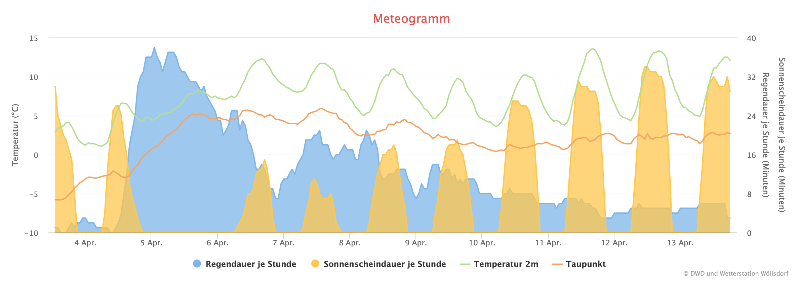
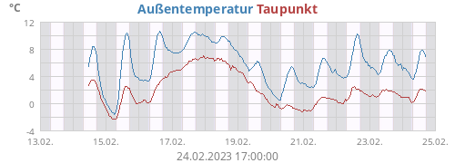

# weewx-DWD

* [English Version](https://github.com/roe-dl/weewx-DWD/blob/master/README-en.md) 
(Work in Progress)
* Icons und Symbole im SVG-Vektorgraphikformat siehe [images](https://github.com/roe-dl/weathericons)
* Icons and symbols in SVG vector graphic format see [images](https://github.com/roe-dl/weathericons)

Wetter- und Warndaten herunterladen und für WeeWX und Web-Darstellung aufbereiten

<p align="center"></p>

Diese Daten können mit den Programmen bezogen werden:
* vom Deutschen Wetterdienst (DWD)
  * vorberechnete Wettervorhersagen auf Stunden-, 3-Stunden- und
    Tagesbasis
    für die nächsten 10 Tage für
    fast 6000 Orte überall auf der Welt (`dwd-mosmix`)
  * Warnmeldungen für Landkreise und Orte in Deutschland
    (`dwd-warnings` und `dwd-cap-warnings`)
  * Wetterkarten (`wget-dwd`)
  * aktuelle Meßwerte von offiziellen DWD-Wetterstationen
    (`user.weatherservices.DWDservice`)
* von der Zentralanstalt für Meteorologie und Geodynamik (ZAMG)
  * aktuelle Meßwerte von offiziellen ZAMG-Wetterstationen
    (`user.weatherservices.DWDservice`)
* über das Open-Meteo-API
  * vorberechnete Wettervorhersagen auf der Basis von Modellen 
    verschiedener großer Wetterdienste für jeden Punkt der Erde
    (`dwd-mosmix`)
* vom Bundesamt für Bevölkerungsschutz und Katastrophenhilfe (BBK)
  * Warnmeldungen (`bbk-warnings`)
* von Meteorological Service Canada (MSC)
  * Warnmeldungen (`msc-warnings`)

Die Daten werden aufbereitet als:
* HTML-Dateien (`*.inc`) zum Einbinden in Skins mittels `#include`
* JSON-Dateien (`*.json`) zur maschinellen Weiterverarbeitung,
  z.B. mittels JavaScript im Browser
* `forecast.json` zur direkten Verwendung mit der Belchertown-Skin


# Melden von Fehlern

Wenn Sie Fehler melden wollen oder Hilfe benötigen, 
geben Sie bitte immer folgende Informationen mit an:
* die komplette Zeile, mit der Sie das Programm aufgerufen haben
* alles, was das Programm ausgegeben hat
* den Abschnitt `[DeutscherWetterdienst]` aus `weewx.conf`, wenn
  es den gibt
* Rufen Sie das Programm noch einmal auf und geben Sie dabei zusätzlich
  den Parameter `--verbose` an. (Nicht bei `wget-dwd`)


# Installation

Für `dwd-mosmix` ist es vorteilhaft, `GeoPy` zu installieren.

```
sudo apt-get install python3-geopy
```

Herunterladen des Paketes von Github:

```
wget -O weewx-snmp.zip https://github.com/roe-dl/weewx-DWD/archive/master.zip
```

Packen Sie die ZIP-Datei aus.

Kopieren Sie `bin/user/weatherservices.py` und `bin/usr/capwarnings.py` ins 
Erweiterungsverzeichnis von WeeWX, typischerweise `/usr/share/weewx/user`.

Kopieren Sie `usr/local/bin/dwd-mosmix`, `usr/local/bin/dwd-warnings`,
`usr/local/bin/html2ent.ansi` und `usr/local/bin/wget-dwd` nach
`/usr/local/bin` und machen Sie sie mit `chmod +x Dateiname` ausführbar.

Legen Sie folgende Links an:
```
sudo ln -s /usr/share/weewx/user/capwarnings.py /usr/local/bin/bbk-warnings
sudo ln -s /usr/share/weewx/user/capwarnings.py /usr/local/bin/dwd-cap-warnings
sudo ln -s /usr/share/weewx/user/capwarnings.py /usr/local/bin/msc-warnings
```

Wenn sich `capwarnings.py` nicht unter `/usr/share/weewx/user` befindet,
müssen Sie den Pfad entsprechend anpassen.

Sollten die Aufrufe von `bbk-warnings` oder `dwd-cap-warnings` zu 
Fehlermeldungen führen, können Sie auch die älteren Dateien
`usr/local/bin/bbk-warnings` und `usr/local/bin/dwd-cap-warnings`
nutzen, indem Sie sie nach `/usr/local/bin` kopieren und ausführbar machen.

Die Icons (Symbole) können beim DWD heruntergeladen werden:
* [Warnicons](https://www.dwd.de/DE/wetter/warnungen_aktuell/objekt_einbindung/icons/warnicons_nach_stufen_50x50_zip.zip?__blob=publicationFile&v=2) 
* [Wettericons](https://www.dwd.de/DE/wetter/warnungen_aktuell/objekt_einbindung/icons/wettericons_zip.zip?__blob=publicationFile&v=3)

# Programme

## wget-dwd

Dieses Script lädt die Wetterkarten sowie die nötigen Dateien für `dwd-warnings` vom Webserver des DWD herunter und speichert sie. Dabei wird eine Log-Datei unter /var/log/ abgelegt, aus der man ersehen kann, ob es geklappt hat.

## dwd-warnings

Dieses Python-Script bereitet die JSONP-Datei des DWD mit den Wetterwarnungen auf und erzeugt daraus HTML-Texte.
Dazu müssen die gewünschten Landkreise in der vom DWD benutzten Schreibweise
in `weewx.conf` eingetragen werden. Die korrekte Schreibweise der Landkreise
kann der Datei 
[warncellids.csv](https://www.dwd.de/DE/leistungen/opendata/help/warnungen/cap_warncellids_csv.html)
oder dem
[Wiki](https://github.com/roe-dl/weewx-DWD/wiki/Namen-der-Landkreise-in-der-Schreibweise-des-Deutschen-Wetterdienstes)
entnommen werden.

Wir empfehlen die Verwendung von `dwd-cap-warnings` anstelle von
`dwd-warnings`.

[Namen der Landkreise in der Schreibweise des Deutschen Wetterdienstes](https://github.com/roe-dl/weewx-DWD/wiki/Namen-der-Landkreise-in-der-Schreibweise-des-Deutschen-Wetterdienstes)

## dwd-cap-warnings

Dieses Python-Script ist eine Alternative zu `dwd-warnings`. Im Gegensatz
zu diesem wertet es die CAP-Dateien des DWD aus, die nicht nur in einer
Auflösung auf Landkreisbasis sondern auch auf Gemeindebasis verfügbar
sind. `dwd-cap-warnings` ist nicht auf einen vorherigen Aufruf von
`wget-dwd` angewiesen. Es erzeugt dieselben Dateien wie `dwd-warnings`.
Um es zu nutzen, muß der Aufruf von `dwd-warnings` in `/etc/cron.hourly/dwd`
durch `dwd-cap-warnings --weewx --resolution=city Z_CAP_C_EDZW_LATEST_PVW_STATUS_PREMIUMCELLS_COMMUNEUNION_DE.zip` ersetzt werden.

`dwd-cap-warnings` kennt die folgenden Optionen:
```
Usage: dwd-cap-warnings [options] [zip_file_name [CAP_file_name]]

  Without an option from the commands group HTML and JSON files are
  created and saved according to the configuration.

Options:
  -h, --help            show this help message and exit
  --config=CONFIG_FILE  Use configuration file CONFIG_FILE.
  --weewx               Read config from weewx.conf.
  --diff                Use diff files instead of status files.
  --resolution=VALUE    Overwrite configuration setting for resolution.
                        Possible values are 'county' and 'city'.
  --lang=ISO639         Alert language. Default 'de'

  Output and logging options:
    --dry-run           Print what would happen but do not do it. Default is
                        False.
    --log-tags          Log tags while parsing the XML file.
    -v, --verbose       Verbose output

  Commands:
    --get-warncellids   Download warn cell ids file.
    --list-ii           List defined II event codes
    --list-zip          Download and display zip file list
    --list-cap          List CAP files within a zip file. Requires zip file
                        name as argument
    --print-cap         Convert one CAP file to JSON and print the result.
                        Requires zip file name and CAP file name as arguments
```

## dwd-mosmix

Dieses Python-Script erzeugt eine Wettervorhersage in Tabellenform und
eine JSON-Datei mit den Inhalten der Wettervorhersage. Es kann auch
die `forecast.json`-Datei für die Belchertown-Skin erzeugen.

Datenquelle sind entweder die MOSMIX-Vorhersagen des Deutschen
Wetterdienstes (DWD) oder die vom Open-Meteo-Dienst bereitgestellten
Vorhersagen auf der Basis des jeweils ausgewählten Wettermodells. 
Die MOSMIX-Vorhersagen basieren auf den Modellen ICON des DWD 
und IFS des ECMWF und werden mit zusätzlichen Informationen verfeinert.

Zur Darstellung sind folgende Ressourcen nötig:
* Wetter-Icons der [Belchertown Skin](https://obrienlabs.net/belchertownweather-com-website-theme-for-weewx/)
  oder des [DWD](https://www.dwd.de/DE/wetter/warnungen_aktuell/objekt_einbindung/piktogramm_node.html)
* Wetter-Icons von [Erik Flowers](https://erikflowers.github.io/weather-icons/)
* zusätzliche CSS-Eintragungen

`dwd-mosmix` kennt die folgenden Optionen:
```
Usage: dwd-mosmix [options] [station]

Options:
  -h, --help            show this help message and exit
  --config=CONFIG_FILE  Use configuration file CONFIG_FILE.
  --weewx               Read config from weewx.conf.
  --orientation=H,V     HTML table orientation horizontal, vertial, or both
  --icon-set=SET        icon set to use, default is 'belchertown', possible
                        values are 'dwd', 'belchertown', and 'aeris'
  --lang=ISO639         Forecast language. Default 'de'
  --aqi-source=PROVIDER Provider for Belchertown AQI section
  --hide-placemark      No placemark caption over forecast table
  --open-meteo=MODEL    use Open-Meteo API instead of DWD MOSMIX

  Output and logging options:
    --dry-run           Print what would happen but do not do it. Default is
                        False.
    --log-tags          Log tags while parsing the KML file.
    -v, --verbose       Verbose output

  Commands:
    --print-icons-ww    Print which icons are connected to which ww weather
                        code
    --html              Write HTML .inc file
    --json              Write JSON file
    --belchertown       Write Belchertown style forecast file
    --database          Write database file
    --print-uba=CMD     download data from UBA

  Intervals:
    --all               Output all details in HTML
    --hourly            output hourly forecast
    --daily             output daily forecast (the default)
```

Es können mehrere der unter "Commands" aufgeführten Optionen gleichzeitig
benutzt werden. 

Der DWD bietet eine Liste der 
[Stationscodes](https://www.dwd.de/DE/leistungen/met_verfahren_mosmix/mosmix_stationskatalog.cfg?view=nasPublication&nn=16102)
zum Herunterladen an.
Nur für die dort aufgeführten Orte sind Vorhersagen beim DWD
verfügbar. Als Code ist der Wert aus der Spalte "id" zu
verwenden. 

Die HTML-Datei enthält, wenn nicht anders konfiguriert, zwei Tabellen,
eine mit waagerechter Ausrichtung für PC-Bildschirme und eine in 
senkrechter Ausrichtung für Telefone. Durch die HTML-Klassenzuordnung
`hidden-xs` und `visible-xs-block` ist immer nur eine davon sichtbar.
Mit der Option `--orientation` kann aber auch eine von beiden fest
ausgewählt werden. Die möglichen Werte sind `h` oder `v` (kann auch
ausgeschrieben werden).

Die Option `--icon-set` gibt an, für welchen Wettersymbolsatz die
Dateien erzeugt werden sollen, den der Belchertown-Skin oder den
des Deutschen Wetterdienstes.

Die Spracheinstellung betrifft nur die Wochentage, bei Englisch auch
die Tooltips der Wettersymbole. Verfügbar ist `de`, `en`, `fr`, `it`
und `cz`.

Wenn die Daten von Open-Meteo anstelle vom DWD bezogen werden, stehen
folgende Modelle zur Auswahl:

--open-meteo=   | Land    | Wetterdienst             | Wettermodell
----------------|---------|--------------------------|---------------
dwd-icon        | DE      | DWD                      | ICON
gfs             | US      | NOAA                     | GFS
meteofrance     | FR      | MeteoFrance              | Arpege+Arome
ecmwf           | EU      | ECMWF                    | open IFS
jma             | JP      | JMA                      | GSM+MSM
metno           | NO      | MET Norway               | Nordic
gem             | CA      | MSC-CMC | GEM+HRDPS
ecmwf_ifs04     | EU      | ECMWF                    | IFS
metno_nordic    | NO      | MET Norway               | Nordic
icon_seamless   | DE      | DWD                      | ICON Seamless
icon_global     | DE      | DWD                      | ICON Global
icon_eu         | DE      | DWD                      | ICON EU
icon_d2         | DE      | DWD                      | ICON D2
gfs_seamless    | US      | NOAA                     | GFS Seamless
gfs_global      | US      | NOAA                     | GFS Global
gfs_hrrr        | US      | NOAA                     | GFS HRRR
gem_seamless    | CA      | MSC-CMC | GEM
gem_global      | CA      | MSC-CMC | GEM
gem_regional    | CA      | MSC-CMC | GEM
gem_hrdps_continental | CA      | MSC-CMC | GEM-HRDPS

Bei der Darstellung der Werte sind die Nutzungsbedingungen sowohl
von Open-Meteo als auch der betreffenden Wetterdienste zu beachten.

## bbk-warnings

Dieses Python-Script lädt Meldungen vom Bundesamt für Bevölkerungsschutz
und Katastrophenhilfe (BBK) herunter. Dabei werden Meldungen ausgelassen,
die ursprünglich vom DWD stammen, da diese mittels `dwd-cap-warnings` 
besser verarbeitet werden können.

Die Warnungen werden vom BBK nur auf Landkreisebene, nicht auf 
Gemeindeebene, herausgegeben. Das bedeutet, daß die letzten sieben
Stellen des ARS 0 sein müssen.

Die ARS, für die Meldungen abzufragen sind, können in beim
Programmaufruf auf der Kommanodozeile oder in der Konfiguration 
angegeben werden.

[Liste der Regionalschlüssel ARS der Landkreise](https://github.com/roe-dl/weewx-DWD/wiki/Namen-der-Landkreise-in-der-Schreibweise-des-Deutschen-Wetterdienstes)

Für eine bundesweite Liste von Warnungen können folgende Kennungen anstelle
des ARS auf der Kommandozeile angegeben werden:
* `katwarn`: Katwarn-Meldungen
* `biwapp`: Biwapp-Meldungen
* `mowas`: Mowas-Meldungen
* `dwd`: Wettermeldungen (nur zusammen mit `--include-dwd`)
* `lhp`: Meldungen des länderübergreifenden Hochwasserportals
* `police`: Polizeiliche Meldungen


## /etc/cron.hourly/dwd

Dieses Script sorgt dafür, daß die beiden Scripte `wget-dwd` und `dwd-warnings` regelmäßig aufgerufen werden.

Der Aufruf von `dwd-warnings` kann auch durch 
```
/usr/local/bin/dwd-cap-warnings --weewx --resolution=city
``` 
bzw.
```
/usr/local/bin/dwd-cap-warnings --weewx --resolution=county
```
ersetzt werden.

Soll `dwd-mosmix` benutzt werden, muß dafür in der Datei die Zeile
```
/usr/local/bin/dwd-mosmix --weewx Station
```
hinzugefügt werden. Wenn die Vorhersage für mehrere Stationen benötigt wird, ist für jede Station ein Aufruf einzutragen.

# WeeWX-Service

Neben den eigenständigen Programmen, die im vorigen Abschnitt beschrieben
sind, gibt es jetzt noch einen WeeWX-Service, der in der für WeeWX
üblichen Weise in das System integriert ist. Längerfristig soll er
die Aufgabe der separaten Programme oder zumindeste deren Aufruf 
übernehmen. Im Moment liefert er eine zusätzliche Funktion, die in den 
Programmen nicht enthalten ist, nämlich den Abruf von Istwerten von 
DWD- und ZAMG-Wetterstationen.

## Wetterdienste und Produkte/Wettermodelle

Mit der Option `provider` wird eingestellt, von welchem Anbieter
die Daten bezogen werden sollen. Die Option `model` spezifiziert
dann ein Wettermodell oder Produkt von diesem Anbieter. 

* DWD POI

  ```
            provider = DWD
            model = POI
  ```

  Unter der Überschrift POI bietet der DWD stündlich aktualisierte
  Werte von einer kleinen Anzahl ausgewählter Wetterstationen,
  zusätzlich aufbereitet mit dem aktuellen Wetterzustand.

  [Liste der Stationen](https://github.com/roe-dl/weewx-DWD/wiki/POI-Stationen-in-Deutschland)

* DWD CDC

  ```
            provider = DWD
            model = CDC
  ```

  Unter der Überschrift CDC werden die blanken Meßwerte zur Verfügung
  gestellt. Dabei sind verschiedene Aktualisierungsraten und 
  Zusammenfassungen verfügbar. Momentan können hier die
  10-Minuten-Werte abgerufen werden.

  [Liste der Stationen](https://opendata.dwd.de/climate_environment/CDC/help/wetter_tageswerte_Beschreibung_Stationen.txt)

* ZAMG

  ```
            provider = ZAMG
  ```

  Auch der österreichische Wetterdienst ZAMG stellt aktuelle Meßwerte
  seiner Stationen im Internet zur Verfügung

  [Liste der Stationen](https://dataset.api.hub.zamg.ac.at/v1/station/current/tawes-v1-10min/metadata)

* Open-Meteo

  ```
            provider = Open-Meteo
            model = Wettermodell_laut_Liste_im_Abschnitt_dwd_mosmix
  ```

  [Open-Meteo](https://open-meteo.com/) stellt ein API zum Abruf von
  Wetterdaten aus den Wettermodellen der großen Wetterdienste bereit. 
  Der gewünschte Ort ist in Form von Koordinaten anzugeben.

## Einbinden in WeeWX

Um den Dienst in WeeWX zu aktivieren, muß er in `weewx.conf` 
eingetragen werden:

```
[Engine]
    [[Services]]
        ...
        data_services = ..., user.weatherservices.DWDservice
        ...
```

Zur Konfiguration, von welchen Stationen Daten abgerufen werden
sollen, siehe Abschnitt "Konfiguration".

## Meßgrößen

Die Namen der Meßgrößen entsprechen den Standardnamen, die WeeWX
verwendet, jeweils mit dem Präfix laut Konfiguration. Der erste
Buchstabe des Namens wird in einen Großbuchstaben verwandelt.
Für die Außentemperatur `outTemp` wäre das bei einem Präfix
`xyz` demzufolge `xyzOutTemp`.

Wenn die Daten auch per MQTT ausgegeben werden sollen, empfiehlt
es sich, im Präfix *keine* Unterstreichstriche zu verwenden,
da diese in den MQTT-Topics zur Trennung von Meßgrößenname und Einheit 
genutzt werden. Das gilt ganz besonders bei Nutzung der
Belchertown-Skin.

Folgende Meßgrößen sind definiert, aber nicht immer verfügbar:
* immer: 
  * `dateTime`: Zeitstempel der Messung 
  * `interval`: Meßinterval (1h bei POI, 10min. bei CDC)
* Sensorgruppe `air`: 
  * `pressure`: Stationsluftdruck QFE
  * `barometer`: auf Meeresniveau umgerechneter Luftdruck
    (bei POI im Datensatz enthalten, bei CDC berechnet,
    wenn `pressure` und `outTemp` verfügbar)
  * `outTemp`: Lufttemperatur 2m über dem Boden 
  * `extraTemp1`: Lufttemperatur 5cm über dem Boden
  * `outHumidity`: relative Luftfeuchtigkeit
  * `dewpoint`: Taupunkttemperatur
* Sensorgruppe `wind`: 
  * `windSpeed`: Windgeschwindigkeit 
  * `windDir`: Windrichtung
* Sensorgruppe `gust`: 
  * `windGust`: Böengeschwindigkeit 
  * `windGustDir`: Böenrichtung
* Sensorgruppe `precipitation`: 
  * `rainDur`: Niederschlagsdauer im Meßintervall 
  * `rain`: Niederschlagsmenge im Meßintervall 
  * `rainIndex`: Niederschlagsart
* Sensorgruppe `solar`: 
  * `solarRad` 
  * `radiation`
  * `sunshineDur`: Sonnenscheindauer im Meßintervall 
  * `LS_10`
* nur bei POI: 
  * `cloudcover`: Wolkenbedeckung in Prozent
  * `cloudbase`: Höhe der Wolkenunterkante 
  * `visibility`: Sichtweite 
  * `presentWeather`: codierter Wetterzustand 
  * `snowDepth`: Schneehöhe
  * `icon`: Symbol des Wetterzustandes (Dateiname) 
  * `icontitle`: Beschreibung dazu
* nur bei CDC: 
  * `station_id`
  * `MESS_DATUM_ENDE`
  * `quality_level`

`icon`, `icontitle`, `station_id` und `MESS_DATUM_ENDE` sind 
Textfelder, die nur mit `.raw` benutzt werden können.

# Searchlist-Erweiterung `$presentweather`

Die Wettervorhersage und auch manche Meßgeräte liefern einen Code `ww` für das
aktuelle Wetter, wie er von der WMO standardisiert worden ist. Diesen
Codes ist jeweils ein passends Icon zugeordnet. Beim Erzeugen der
Wettervorhersagen mit `dwd-mosmix` wird das Icon zugeordnet und in
die Tabelle eingefügt. 

Steht der Wert dagegen zum Beispiel als Meßgröße zur Verfügung, dann kann 
man diese Searchlist-Erweiterung benutzen, um das zum Code passende Icon
darzustellen.

In `skin.conf` ist dazu folgende Eintragung nötig:

```
[CheetahGenerator]
    search_list_extensions = user.weathercodes.WeatherSearchList
    ...
```

Gibt es die Zeile `search_list_extensions` schon, ist der Wert am Schluß
mit Komma getrennt anzufügen.

Anschließend steht ein neues Tag zur Verfügung:

```
$presentweather(ww=$ww, n=$n, night=$night, wawa=$wawa).attr
```

Die Parameter sind:
* `ww`: der Wettercode ww oder eine Liste von Wettercodes, von denen
   der "schlimmste" verwendet wird
* `n`: die Wolkenbedeckung in Prozent (nur bei $ww<4 nötig)
* `night`: `True`, wenn das Nachtsymbol verwendet werden soll
* `wawa`: der Wettercode w<sub>a</sub>w<sub>a</sub> oder eine Liste von 
   Wettercodes, von denen der "schlimmste" verwendet wird

Alle Parameter sind optional. Wenigstens einer von den Parametern
`ww`, `n` und `wawa` muß ungleich `None` sein. Wenn sowohl `ww` als
auch `wawa` vorhanden sind, wird `ww` verwendet und `wawa` ignoriert.
`n` wird verwendet, wenn `ww` und `wawa` `None` oder kleiner 4 sind.

`attr` ist eine der folgenden Möglichkeiten:
* `ww`: der Wettercode, der aus der Liste herausgesucht wurde
* `text`: Beschreibung des zugehörigen Wetterereignisses
* `belchertown_icon`: Dateiname des Icons aus dem Belchertown-Icon-Satz
* `dwd_icon`: Dateiname des Icons aus dem DWD-Icon-Satz
* `aeris_icon`: Dateiname des Icons aus dem Aeris-Icon-Satz
* `wi_icon`: Icon aus dem Icon-Satz von Erik Flowers
* `wmo_symbol`: Symbol der Meteorologen für den Wetterzustand
* `wmo_symbol($width,color=$color)`: Symbol der Meteorologen für den 
  Wetterzustand mit Größenangabe und optionaler Farbangabe.
* `n`: Wolkenbedeckung in Prozent (nur wenn nur `n` übergeben wurde)
* `okta`: Wolkenbedeckung in Okta (nur wenn nur `n` übergeben wurde)

Die Dateinamen werden zusammen mit dem HTML-Tag `` verwendet,
zum Beispiel:

```

```

`wmo_symbol` wird dagegen direkt verwendet, zum Beispiel:

```
$presentweather($ww,$n,$night).wmo_symbol(30)
```

Wird eine Farbe angegeben, wird das ganze Symbol einfarbig in dieser
Farbe dargestellt. Wird keine Farbe angegeben, wird das Symbol in
der Originalfarbgebung (ggf. mehrfarbig) dargestellt.

Ebenso wird `wi_icon` direkt verwendet, zum Beispiel:

```
$presentweather($ww,$n,$night).wi_icon
```

Weitere Informationen:
* [Wiki-Artikel `$presentweather()`](https://github.com/roe-dl/weewx-DWD/wiki/$presentweather())
  mit Verwendungsbeispiel
* [Wiki-Artikel Wettersymbole (Icons)](https://github.com/roe-dl/weewx-DWD/wiki/Wettersymbole-(Icons))
* [Aussehen und Beschreibung der Symbole](https://www.woellsdorf-wetter.de/info/symbols.html)

Beispiel: Belchertown-Icons
Nebel | Nieselregen | Regen | Hagel | Schneeregen | Schnee | Gewitter | Wind | Tornado
----|---------|------|------|-------|------|--------------|------|---------
 |  | |  |  |  |  |  | 

WMO-Symbole
WMO-Code-Tabelle 4677 ww | WMO-Code-Tabelle 4680 w<sub>a</sub>w<sub>a</sub>
-------------------------|---------------------------
 | 

Mittels
```
python3 /usr/share/weewx/user/weathercodes.py --write-svg Zielverzeichnis
```
können alle WMO-Symbole als SVG-Dateien in "Zielverzeichnis" geschrieben
werden. Diese Dateien können dann mit dem ``-Tag in Webseiten
eingefügt werden.

Mit 
```
python3 /usr/share/weewx/user/weathercodes.py --print-ww-tab >wmo4677.inc
python3 /usr/share/weewx/user/weathercodes.py --print-wawa-tab >wmo4680.inc
```
kann eine HTML-Tabelle der Symbole zum Einfügen in Webseiten erzeugt werden.

# Warnregionen

Die Warnungen in der JSONP-Datei `warnings.json` ist nach Landkreisen gegliedert. Manche Landkreise sind dann noch weiter nach Landschaftsmerkmalen wie etwa Bergland und Tiefland unterteilt. Andere Dateien sind nach Bundesländern gegliedert. Im Wiki sind die vom Deutschen Wetterdienst verwendeten Bezeichnungen und Abkürzungen beschrieben:

* [Abkürzungen der Bundesländer](https://github.com/roe-dl/weewx-DWD/wiki/Abkürzungen-der-Bundesländer-beim-Deutschen-Wetterdienst)
* [Bezeichnungen der Warnregionen](https://github.com/roe-dl/weewx-DWD/wiki/Namen-der-Landkreise-in-der-Schreibweise-des-Deutschen-Wetterdienstes)

# Konfiguration

## Verzeichnis anlegen

Im Verzeichnis der Visualisierung (skin), wo die Meldungen des DWD 
angezeigt werden sollen, muß ein Unterverzeichnis (Ordner) `dwd` angelegt 
werden. (Es sind auch andere Namen möglich.) In das Skript `wget-dwd` 
sowie die Konfigurationsdatei `weewx.conf` (siehe unten) muß der 
komplette Pfad dieses Verzeichnisses eingetragen werden.

Beispiel:
```
cd /etc/weewx/skins/Belchertown
mkdir dwd
```

`Belchertown` im Beispiel ist durch den zutreffenden Namen zu ersetzen.

In dieses Verzeichnis speichern die Scripte die erzeugten Warn- und
Vorhersage-Dateien.

## Konfiguration in weewx.conf

Die Eintragungen in weewx.conf müssen mit der Hand vorgenommen werden. Es
gibt gegenwärtig kein Installationsprogramm dafür. Nur für Funktionen,
die tatsächlich genutzt werden, müssen die Abschnitte vorhanden sein.

Beispiel:
```
[DeutscherWetterdienst]
    # Konfiguration für dwd-cap-warnings
    [[warning]]
        icons='../dwd/warn_icons_50x50'
        states='Sachsen','Thüringen'
        resolution = county|city
        [[[counties]]]
              'Kreis Mittelsachsen - Tiefland'='DL'
              'Stadt Leipzig'='L'
              'Stadt Jena'='J'
              'Stadt Dresden'='DD'
        [[[cities]]]
              'Stadt Döbeln'='DL'
              'Stadt Waldheim'='DL'
              'Leipzig-Mitte'='L'
              'Stadt Jena'='J'
              'Dresden-Altstadt'='DD'
[WeatherServices]
    # Verzeichnis, in das die Dateien gespeichert werden sollen
    path='/etc/weewx/skins/Belchertown/dwd'
    # Konfiguration zum Download aktueller Meßwerte von offiziellen
    # Stationen
    [[current]]
        # Es folgen Beispiele.
        [[[station_nr]]]
            provider = ZAMG  # DWD, ZAMG or Open-Meteo
            prefix = observation_type_prefix_for_station
            # equipment of the weather station (optional)
            observations = air,wind,gust,precipitation,solar
        [[[station_code]]]
            provider = DWD
            model = POI
            prefix = observation_type_prefix_for_station
        [[[station_id]]]
            provider = DWD
            model = CDC
            prefix = observation_type_prefix_for_station
            # equipment of the weather station (optional)
            observations = air,wind,gust,precipitation,solar
        [[[ThisStation]]]
            # actual readings out of the forecast for the location of this station
            provider = Open-Meteo
            model = dwd-icon
            prefix = observation_type_prefix
    # Konfiguration für dwd-mosmix
    [[forecast]]
        # Speicherort der Symbole auf dem Web-Server
        icons = '../images'
        # zu verwendender Symbolsatz: belchertown, dwd, aeris
        icon_set = belchertown
        # für welche Orientierungen soll die HTML-Datei erzeugt werden?
        orientation = h,v
        # Sollen die Meßgrößensymbole in die Tabelle aufgenommen werden?
        #show_obs_symbols = True # optional
        # Soll die Meßgrößenbeschreibung in die Tabelle aufgenommen werden?
        #show_obs_description = False # optional
        # Soll der Ortsname über die Tabelle geschrieben werden?
        #show_placemark = True # optional
    # Warnungen (dwd-cap-warnings, bbk-warnings, msc-warnings)
    [[warning]]
        #icons = ... # Optional, für alle Provider
        #bbk_icons = ... # Optional, nur für BBK
        #bbk_logos = ... # Optional, nur für BBK
        #bbk_include_dwd ... # Optional, nur für BBK
        #dwd_icons = ... # Optional, nur für DWD
        #dwd_status_url = ... # Optional, nur für DWD
        #dwd_diff_url = ... # Optional, nur für DWD
        # Beispiele
        [[[1]]]
            provider = MSC # Canada
            office = ... # Code of the issuing office (try without if unsure)
            county = county_name
            file = target_file
        [[[145220000000]]]
            provider = BBK 
            # Die Überschrift ist die Kreiskennung.
            file = DL
        [[[Leipzig]]]
            provider = BBK
            county = 147130000000 
            file = L
     # Konfiguration für die --belchertown Option von dwd-mosmix
     [[Belchertown]]
        # Name des Abschnittes der Belchertown-Skin in [StdReport]
        section = Belchertown
        # Warndatei aus dem Abschnitt [[warnings]]
        warnings = DL
        # Vorhersagedatei aus dem Aufruf 'dwd-mosmix'
        forecast = P0291
        # schließe Warnungen ein, die die angegebene Zahl von Sekunden in
        # der Zukunft gültig werden (optional)
        #include_advance_warnings = 0 
        # Quelle für Luftqualtitätsdaten (optional)
        # mögliche Werte: aeris, ubaXXXX
        #aqi_source = ...
        # Sprache für die Himmelsrichtungen (optional)
        # mögliche Werte: de, en, fr, it, cz, es, nl, no, gr
        #compass_lang = 'de' # optional
```

Der Eintrag `path` muß auf das im ersten Schritt angelegte Verzeichnis
zeigen.

Die Pfade, Bundesländer und Landkreise sind den Erfordernissen bzw.
tatsächlichen Verhältnissen entsprechend einzutragen. Die Bezeichnungen
sind der Datei warncellids.csv zu entnehmen, die beim DWD heruntergeladen
werden kann.

**Beachte**: Der Pfad bei `icons` bezieht sich auf den Web-Server. 
Er darf nicht mit `/` beginnen.

Für jeden Landkreis, für den Warnungen angezeigt werden sollen, muß
ein Eintrag unter "counties" vorhanden sein. Das Kürzel hinter dem
Gleichheitszeichen fasst die Meldungen in Dateien zusammen, für jedes
Kürzel eine. Ansonsten kann das Kürzel frei gewählt werden.

Bei Nutzung von `dwd-cap-warnings` können statt Landkreisen auch
Gemeinden ausgewählt werden, die unter "cities" einzutragen sind.
Ob die Warnungen auf Landkreis- oder Gemeindebasis angezeigt werden,
wird mit der Option `--resolution` beim Aufruf von `dwd-cap-warnings`
eingestellt. Alternativ kann die Option auch in die Konfigurationsdatei
eingetragen werden.

Mögliche Werte für `station_code` finden Sie beim DWD unter
[DWD-Stationsübersicht](https://www.dwd.de/DE/leistungen/klimadatendeutschland/stationsuebersicht.html).

Mögliche Werte für `station_id` finden Sie beim DWD zum Beispiel unter
[DWD-Beschreibung-Stationen](https://opendata.dwd.de/climate_environment/CDC/observations_germany/climate/10_minutes/air_temperature/now/zehn_now_tu_Beschreibung_Stationen.txt)
Unter `observations` sollten nur die Sensorengruppen aufgeführt werden,
die an der betreffenden Station tatsächlich verfügbar sind.

## Wo können die nachfolgenden Beispiele eingefügt werden?

### Belchertown-Skin

Hier ist schon vorgesehen, daß zusätzliche Abschnitte eingefügt werden.
Dazu muß einfach eine Datei unter einem der folgenden Namen erstellt
werden. Sie wird automatisch eingebunden, wenn sie existiert:
* `index_hook_after_station_info.inc`
* `index_hook_after_forecast.inc`
* `index_hook_after_snapshot.inc`
* `index_hook_after_charts.inc`

Der Name bezeichnet schon die Einfügestelle auf der Startseite.

### andere Skins

Wenn es keine solchen vorbereiteten Einfügestellen gibt, müssen die
Beispiele in eine der Dateien mit der Endung `.html.tmpl`
eingefügt werden.

## Text-Vorhersage im HTML-Template

Bitte "DWLG" im folgenden Beispiel durch die Abkürzung des gewünschten Bundeslandes aus Spalte "VHDL" ersetzen.

```
  <div class="col-sm-12" style="margin-bottom:1em">
    #if os.path.exists("dwd/VHDL50_DWLG_LATEST.html")
    #include raw "dwd/VHDL50_DWLG_LATEST.html"
    [Quelle:
    <a
    href="https://www.dwd.de/DE/wetter/wetterundklima_vorort/sachsen/sac_node.html"
    target="_blank">DWD</a>]
    #end if
  </div>
```

## Wetterwarnungen im HTML-Template

Bitte "DL" durch den jeweiligen Gebietscode ersetzen wie in `/usr/local/bin/dwd-warnings` definiert.

```
  <div class="col-sm-6">
    <p style="font-size:110%">Wetterwarnungen</p>
    #include raw "dwd/warn-DL.inc"
  </div>

```

Beispiel für eine Wetterwarnung:


## Wettervorhersage im HTML-Template

Bitte "P0291" durch den gewünschten Stationscode ersetzen.

```
  <div class="col-sm-8">
    <p style="font-size:110%">Wettervorhersage</p>
    #include raw "dwd/forecast-P0291.inc"
  </div>
```

Dazu muß die Stylesheet-Datei ergänzt werden, bei der Belchertown-Skin
wäre das `custom.css`:
```
.dwdforecasttable {
    line-height: 1.0;
}
.dwdforecasttable td {
    text-align: center;
    padding-left: 3px;
    padding-right: 3px;
    line-height: 1.2;
}
.dwdforecasttable .icons td {
    padding-top: 5px;
    padding-bottom: 0px;
}
.dwdforecasttable .topdist td {
    padding-top: 5px;
}
.light .dwdforecasttable td.weekend {
    background-color: #ffe;
}
.dark .dwdforecasttable td.weekend {
    background-color: #333;
}
```

Beispiel für eine Wettervorhersage:


## DWD-Wettervorhersage in der Belchertown-Skin

Mit der speziellen Option `--belchertown` erzeugt `dwd-mosmix` die
`forecast.json`-Datei für die Belchertown-Skin. Damit kann die
Wettervorhersage des DWD in die Belchertown-Skin integriert werden,
**ohne daß Eingriffe in den Code nötig sind**. Nur die Konfigurationsoption
`forecast_stale`
muß geändert werden, entweder in `skin.conf` oder im Abschnitt der
Skin in `weewx.conf`. Die Vorhersage muß natürlich auch grundsätzlich 
eingeschaltet sein.

```
    forecast_enabled = 1
    forecast_stale = 86400
    forecast_alert_enabled = 1
```

Für das Einheitensystem gibt es eine gesonderte Einstellung für die
Vorhersage in der Belchertown-Skin. `forecast_units = si` stellt
auf metrische Einheiten ein, `forecast_units = us` auf US-amerikanische
Einheiten.

Außerdem muß der Abschnitt des Deutschen Wetterdienstes in `weewx.conf`
ergänzt werden:

```
[WeatherServices]
    ...
    [[Belchertown]]
        section = "Belchertown"
        warnings = DL
        forecast = P0291
        #include_advance_warnings = 0 # optional
        #aqi_source = None # optional
        #compass_lang = 'en' # optional, alternative 'de','fr','cz'
```

Der Schlüssel `section` muß den Namen des Abschnittes der Belchertown-Skin 
unter `[StdReport]` angeben. Der Schlüssel `warnings` gibt das Kürzel der 
zu verwendenden Warn-Datei aus dem Abschnitt `[[warning]]` an. 
Der Schlüssel `forecast` gibt das Kürzel der Station an, deren Vorhersage 
verwendet werden soll. Im Falle von Open-Meteo lautet die Angabe
`openmeteo-latitude-longitude-model`, wobei 'latitude' durch die
georaphische Breite, 'longitude' durch die geographische Länge und
'model' durch das Wettermodel zu ersetzen ist.
Mit dem optionalen Schlüssel `include_advance_warnings` kann man eine Zeitspanne
in Sekunden vorgeben. Es werden dann neben den aktiven Warnungen auch
Warnungen angezeigt, die bis zu der angegebenen Zahl Sekunden in der
Zukunft aktiv werden.

Mit `aqi_source` kann man einen Provider angeben, von dem AQI-Daten
bezogen werden sollen. Momentan mögliche Werte sind `aeris` und `ubaXXXX`,
wobei XXXX durch die Nummer der Station zu ersetzen ist, deren
Werte abgerufen werden sollen.

*Beachte*: Bei Aeris ist die Anzahl der Anfragen pro Tag limitiert.
Es ist darüber hinaus ein Account nötig.

Eine Liste der Luftqualitätsmeßstationen des deutschen Umweltbundesamtes (UBA) 
erhält man mit
```
usr/local/bin/dwd-mosmix --print-uba=meta,measure
```

Beim Aufruf der Programme muß `dwd-cap-warnings` ungedingt vor `dwd-mosmix`
aufgerufen werden, sonst werden unter Umständen veraltete Warnungen 
verarbeitet.

In `/etc/cron.hourly/dwd` ist dann die folgende Zeile hinzufügen:
```
/usr/local/bin/dwd-mosmix --weewx --belchertown Stationsname
```

Soll das Programm zu Testzwecken von der Kommandozeile aufgerufen werden,
ist `sudo` nötig:
```
sudo /usr/local/bin/dwd-mosmix --weewx --belchertown Stationsname
```

## Wettervorhersage als Diagramm

Mit der Option `--database` wird eine SQLITE-Datenbankdatei erzeugt,
die von WeeWX zur Anzeige von Diagrammen genutzt werden kann. Die
Datei wird in das durch `SQLITE_ROOT` definierte Verzeichnis 
geschrieben und erhält den Namen `dwd-forecast-Stationscode.sdb`.

Die Werte sind grundsätzlich stündlich.

Um damit Diagramme darstellen zu können, muß die Datenbank in 
`weewx.conf` hinzugefügt werden:

```
[DataBindings]
    ...
    [[dwd_binding]]
        database = dwd_sqlite
        table_name = forecast
        manager = weewx.manager.Manager
        schema = schemas.dwd.schema
[Databases]
    ...
    [[dwd_sqlite]]
        database_name = dwd-forecast-Stationscode.sdb
        database_type = SQLite
```

In das Verzeichnis `schemas` muß eine Datei `dwd.py` geschrieben
werden, die folgenden Inhalt hat:
```
schema = [('dateTime','INTEGER NOT NULL PRIMARY KEY'),
          ('usUnits','INTEGER NOT NULL'),
          ('interval','INTEGER NOT NULL')]
```

In `user/extensions.py` sind ggf. die fehlenden Meßgrößen zu definieren:
```
import weewx.units
weewx.units.obs_group_dict['pop'] = 'group_percent'
weewx.units.obs_group_dict['cloudcover'] = 'group_percent'
weewx.units.obs_group_dict['sunshineDur'] = 'group_deltatime'
weewx.units.obs_group_dict['rainDur'] = 'group_deltatime'
```

Vorhersagegrößen:
* `outTemp`: Lufttemperatur 2m
* `dewpoint`: Taupunkt 2m
* `windDir`: Windrichtung
* `windSpeed`: Windgeschwindigkeit
* `windGust`: Böengeschwindigkeit
* `pop`: Regenwahrscheinlichkeit
* `cloudcover`: Wolkenbedeckung
* `barometer`: Luftdruck
* `rain`: Regenmenge
* `rainDur`: Regendauer innerhalb der letzten Stunde
* `sunshineDur`: Sonnenscheindauer innerhalb der letzten Stunde

### Belchertown-Skin

Beispielkonfiguration in `graphs.conf` für Belchertown-Skin:
```
    [[forecast]]
        tooltip_date_format = "dddd LLL"
        gapsize = 3600 # 1 hour in seconds
        credits = "&copy; DWD"
        data_binding = dwd_binding
        time_length = all
        [[[outTemp]]]
        [[[dewpoint]]]
```

Beispiel:


### Andere Skins

Beispielkonfiguration in `skin.conf`:
```
[ImageGenerator]
    ...
    [[day_images]]
        ...
        [[[forecast]]]
            data_binding = dwd_binding
            line_gap_fraction = 0.04
            time_length = 950400
            x_label_format = %d.%m.
            [[[[outTemp]]]]
            [[[[dewpoint]]]]
```



## Wetterkarte im HTML-Template

Der Pfad, hier `dwd`, ist entsprechend der eigenen Konfiguration anzupassen. Das Anhängsel mit `getmtime` ist notwendig, damit der Browser keine veralteten Karten anzeigt. Damit wird der Cache beim Nutzer überlistet.

```
  <div class="col-sm-12 snapshot-records-text">
    Wetterkarte (Luftdruck am Boden)
  </div>
  
  <div class="col-sm-12">
    " />
  </div>
```

Damit die Wetterkarte auch mit auf den Server hochgeladen wird, muß sie in `skin.conf` ergänzt werden:

```
[CopyGenerator]
    ...
    copy_always = ...,dwd/bwk_bodendruck_na_ana.png
```

Anstelle von `bwk_bodendruck_na_ana.png` (Europa-Nordatlantik) kann in den obigen Beispielen 
auch `bwk_bodendruck_weu_ana.png` (West-Mittel-Europa) verwendet werden. Beide Karten werden
von `wget-dwd` heruntergeladen.

# Verweise

* [WeeWX Homepage](http://weewx.com) - [WeeWX Wiki](https://github.com/weewx/weewx/wiki)
* [Seite "Homepagewetter" des Deutschen Wetterdienstes](https://www.dwd.de/DE/wetter/warnungen_aktuell/objekt_einbindung/objekteinbindung_node.html)
* [Warnicons](https://www.dwd.de/DE/wetter/warnungen_aktuell/objekt_einbindung/icons/warnicons_nach_stufen_50x50_zip.zip?__blob=publicationFile&v=2)
* [Seite "Wetter und Klima vor Ort" des Deutschen Wetterdienstes mit Unterseiten für die Bundesländer](https://www.dwd.de/DE/wetter/wetterundklima_vorort/_node.html)
* [Seite "Warnlagebericht" des Deutschen Wetterdienstes mit Unterseiten für die Bundesländer](https://www.dwd.de/DE/wetter/warnungen_aktuell/warnlagebericht/warnlagebericht_node.html)
* [DWD-MOSMIX](https://www.dwd.de/DE/leistungen/met_verfahren_mosmix/met_verfahren_mosmix.html)
* [gesprochene Wetterberichte mit Python](https://beltoforion.de/de/wetterbericht/)
* [Open-Meteo](https://open-meteo.com/)
