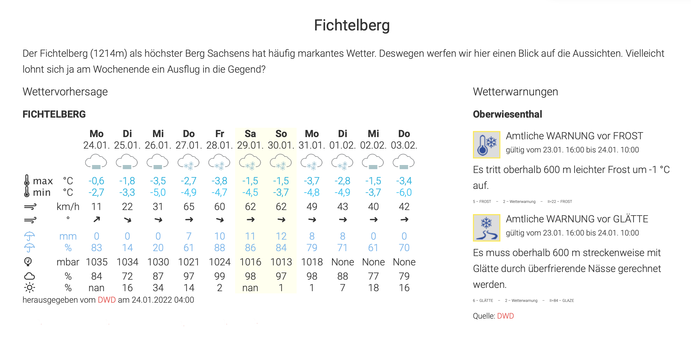
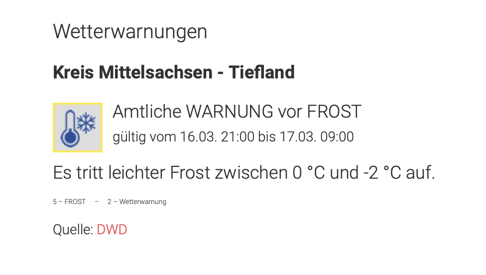
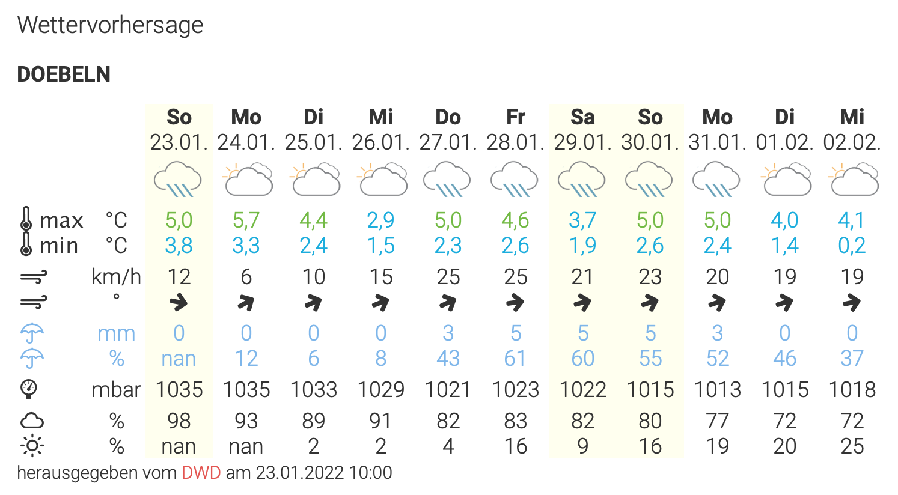

# weewx-DWD
Daten vom Deutschen Wetterdienst (DWD) herunterladen und für WeeWX aufbereiten



# Installation

Alle Dateien müssen in die jeweiligen Verzeichnisse kopiert und mit `chmod +x Dateiname` ausführbar gemacht werden.

Die Icons (Symbole) können beim DWD unter [Warnicons](https://www.dwd.de/DE/wetter/warnungen_aktuell/objekt_einbindung/icons/warnicons_nach_stufen_50x50_zip.zip?__blob=publicationFile&v=2) heruntergeladen werden.

# Programme

## wget-dwd

Dieses Script lädt die nötigen Dateien vom Webserver des DWD herunter und speichert sie. Dabei wird eine Log-Datei unter /var/log/ abgelegt, aus der man ersehen kann, ob es geklappt hat.

## dwd-warnings

Dieses Python-Script bereitet die JSONP-Datei des DWD mit den Wetterwarnungen auf und erzeugt daraus HTML-Texte.
Dazu müssen die gewünschten Landkreise in der vom DWD benutzten Schreibweise
in `weewx.conf` eingetragen werden. Um herauszufinden, wie der Landkreis korrekt geschrieben werden muß, öffnet man die Datei `warnings.json`, die von `wget-dwd` heruntergeladen wurde, mit einem Browser, der JSON-Dateien anzeigen kann (z.B. Firefox). Dort kann man dann den gewünschten Landkreis suchen und sehen, wie er geschrieben wurde. Beachte: Wenn der Landkreis keine Warnungen hat, kommt er in der Datei gar nicht vor. Dann muß man warten, bis es wieder Warnungen gibt.

[Namen der Landkreise in der Schreibweise des Deutschen Wetterdienstes](https://github.com/roe-dl/weewx-DWD/wiki/Namen-der-Landkreise-in-der-Schreibweise-des-Deutschen-Wetterdienstes)

## dwd-cap-warnings

Dieses Python-Script ist eine Alternative zu `dwd-warnings`. Im Gegensatz
zu diesem wertet es die CAP-Dateien des DWD aus, die nicht nur in einer
Auflösung auf Landkreisbasis sondern auch auf Gemeindebasis verfügbar
sind. `dwd-cap-warnings` ist nicht auf einen vorherigen Aufruf von
`wget-dwd` angewiesen. Es erzeugt dieselben Dateien wie `dwd-warnings`.
Um es zu nutzen, muß der Aufruf von `dwd-warnings` in `/etc/cron.hourly/dwd`
durch `dwd-cap-warnings --weewx --resolution=city Z_CAP_C_EDZW_LATEST_PVW_STATUS_PREMIUMCELLS_COMMUNEUNION_DE.zip` ersetzt werden.

`dwd-cap-warnings` kennt die folgenden Optionen:
```
Usage: dwd-cap-warnings [options] [zip_file_name [CAP_file_name]]

  Without an option from the commands group HTML and JSON files are
  created and saved according to the configuration.

Options:
  -h, --help            show this help message and exit
  --config=CONFIG_FILE  Use configuration file CONFIG_FILE.
  --weewx               Read config from weewx.conf.
  --diff                Use diff files instead of status files.
  --resolution=VALUE    Overwrite configuration setting for resolution.
                        Possible values are 'county' and 'city'.
  --lang=ISO639         Alert language. Default 'de'

  Output and logging options:
    --dry-run           Print what would happen but do not do it. Default is
                        False.
    --log-tags          Log tags while parsing the XML file.
    -v, --verbose       Verbose output

  Commands:
    --get-warncellids   Download warn cell ids file.
    --list-ii           List defined II event codes
    --list-zip          Download and display zip file list
    --list-cap          List CAP files within a zip file. Requires zip file
                        name as argument
    --print-cap         Convert one CAP file to JSON and print the result.
                        Requires zip file name and CAP file name as arguments
```

## dwd-mosmix

Dieses Python-Script erzeugt eine Wettervorhersage in Tabellenform und
eine JSON-Datei mit den Inhalten der Wettervorhersage.

Zur Darstellung sind folgende Ressourcen nötig:
* Wetter-Icons der [Belchertown Skin](https://obrienlabs.net/belchertownweather-com-website-theme-for-weewx/)
* Wetter-Icons von [Erik Flowers](https://erikflowers.github.io/weather-icons/)
* zusätzliche CSS-Eintragungen

`dwd-mosmix` kennt die folgenden Optionen:
```
Usage: dwd-mosmix [options] [station]

Options:
  -h, --help            show this help message and exit
  --config=CONFIG_FILE  Use configuration file CONFIG_FILE.
  --weewx               Read config from weewx.conf.

  Output and logging options:
    --dry-run           Print what would happen but do not do it. Default is
                        False.
    --log-tags          Log tags while parsing the KML file.
    -v, --verbose       Verbose output
```

Der DWD bietet eine Liste der 
[Stationscodes](https://www.dwd.de/DE/leistungen/met_verfahren_mosmix/mosmix_stationskatalog.cfg?view=nasPublication&nn=16102)
zum Herunterladen an.
Nur für die dort aufgeführten Orte sind Vorhersagen beim DWD
verfügbar. Als Code ist der Wert aus der Spalte "id" zu
verwenden. 


## /etc/cron.hourly/dwd

Dieses Script sorgt dafür, daß die beiden Scripte `wget-dwd` und `dwd-warnings` regelmäßig aufgerufen werden.

# Warnregionen

Die Warnungen in der JSONP-Datei `warnings.json` ist nach Landkreisen gegliedert. Manche Landkreise sind dann noch weiter nach Landschaftsmerkmalen wie etwa Bergland und Tiefland unterteilt. Andere Dateien sind nach Bundesländern gegliedert. Im Wiki sind die vom Deutschen Wetterdienst verwendeten Bezeichnungen und Abkürzungen beschrieben:

* [Abkürzungen der Bundesländer](https://github.com/roe-dl/weewx-DWD/wiki/Abkürzungen-der-Bundesländer-beim-Deutschen-Wetterdienst)
* [Bezeichnungen der Warnregionen](https://github.com/roe-dl/weewx-DWD/wiki/Namen-der-Landkreise-in-der-Schreibweise-des-Deutschen-Wetterdienstes)

# Konfiguration

Im Verzeichnis der Visualisierung (skin), wo die Meldungen des DWD angezeigt werden sollen, muß ein Unterverzeichnis (Ordner) `dwd` angelegt werden. (Es sind auch andere Namen möglich.) In das Skript `wget-dwd` sowie die Konfigurationsdatei `weewx.conf` (siehe unten) muß der komplette Pfad dieses Verzeichnisses eingetragen werden.

## Konfiguration in weewx.conf

Die Eintragungen in weewx.conf müssen mit der Hand vorgenommen werden. Es
gibt gegenwärtig kein Installationsprogramm dafür.

Beispiel:
```
[DeutscherWetterdienst]
    path='/etc/weewx/skins/Belchertown/dwd'
    [[warning]]
        icons='../dwd/warn_icons_50x50'
        states='Sachsen','Thüringen'
        [[[counties]]]
              'Kreis Mittelsachsen - Tiefland'='DL'
              'Stadt Leipzig'='L'
              'Stadt Jena'='J'
              'Stadt Dresden'='DD'
        [[[cities]]]
              'Stadt Döbeln'='DL'
              'Stadt Waldheim'='DL'
              'Leipzig-Mitte'='L'
              'Stadt Jena'='J'
              'Dresden-Altstadt'='DD'
    [[forecast]]
        icons='../images'
```

Die Pfade, Bundesländer und Landkreise sind den Erfordernissen bzw.
tatsächlichen Verhältnissen entsprechend einzutragen. Die Bezeichnungen
sind der Datei warncellids.csv zu entnehmen, die beim DWD heruntergeladen
werden kann.

**Beachte**: Der Pfad bei `icons` bezieht sich auf den Web-Server. 
Er darf nicht mit `/` beginnen.

Für jeden Landkreis, für den Warnungen angezeigt werden sollen, muß
ein Eintrag unter "counties" vorhanden sein. Das Kürzel hinter dem
Gleichheitszeichen fasst die Meldungen in Dateien zusammen, für jedes
Kürzel eine. Ansonsten kann das Kürzel frei gewählt werden.

Bei Nutzung von `dwd-cap-warnings` können statt Landkreisen auch
Gemeinden ausgewählt werden, die unter "cities" einzutragen sind.
Ob die Warnungen auf Landkreis- oder Gemeindebasis angezeigt werden,
wird mit der Option `--resolution` beim Aufruf von `dwd-cap-warnings`
eingestellt. Alternativ kann die Option auch in die Konfigurationsdatei
eingetragen werden.

## Text-Vorhersage im HTML-Template

Bitte "DWLG" im folgenden Beispiel durch die Abkürzung des gewünschten Bundeslandes aus Spalte "VHDL" ersetzen.

```
  <div class="col-sm-12" style="margin-bottom:1em">
    #if os.path.exists("dwd/VHDL50_DWLG_LATEST.html")
    #include raw "dwd/VHDL50_DWLG_LATEST.html"
    [Quelle:
    <a
    href="https://www.dwd.de/DE/wetter/wetterundklima_vorort/sachsen/sac_node.html"
    target="_blank">DWD</a>]
    #end if
  </div>
```

## Wetterwarnungen im HTML-Template

Bitte "DL" durch den jeweiligen Gebietscode ersetzen wie in `/usr/local/bin/dwd-warnings` definiert.

```
  <div class="col-sm-6">
    <p style="font-size:110%">Wetterwarnungen</p>
    #include raw "dwd/warn-DL.inc"
  </div>

```

Beispiel für eine Wetterwarnung:



## Wettervorhersage im HTML-Template

Bitte "P0291" durch den gewünschten Stationscode ersetzen.

```
  <div class="col-sm-8">
    <p style="font-size:110%">Wettervorhersage</p>
    #include raw "dwd/forecast-P0291.inc"
  </div>
```

Dazu muß die Stylesheet-Datei ergänzt werden, bei der Belchertown-Skin
wäre das `custom.css`:
```
.dwdforecasttable {
    line-height: 1.0;
    width: auto;
}
.dwdforecasttable td {
    text-align: center;
    padding-left: 3px;
    padding-right: 3px;
    line-height: 1.2;
}
.dwdforecasttable .icons td {
    padding-top: 5px;
    padding-bottom: 0px;
}
.dwdforecasttable .topdist td {
    padding-top: 5px;
}
.light .dwdforecasttable td.weekend {
    background-color: #ffe;
}
.dark .dwdforecasttable td.weekend {
    background-color: #333;
}
```

Beispiel für eine Wettervorhersage:



## Wetterkarte im HTML-Template

Der Pfad, hier `dwd`, ist entsprechend der eigenen Konfiguration anzupassen. Das Anhängsel mit `getmtime` ist notwendig, damit der Browser keine veralteten Karten anzeigt. Damit wird der Cache beim Nutzer überlistet.

```
  <div class="col-sm-12 snapshot-records-text">
    Wetterkarte (Luftdruck am Boden)
  </div>
  
  <div class="col-sm-12">
    " />
  </div>
```

Damit die Wetterkarte auch mit auf den Server hochgeladen wird, muß sie in `skin.conf` ergänzt werden:

```
[CopyGenerator]
    ...
    copy_always = ...,dwd/bwk_bodendruck_na_ana.png
```

# Verweise

* [WeeWX Homepage](http://weewx.com) - [WeeWX Wiki](https://github.com/weewx/weewx/wiki)
* [Seite "Homepagewetter" des Deutschen Wetterdienstes](https://www.dwd.de/DE/wetter/warnungen_aktuell/objekt_einbindung/objekteinbindung_node.html)
* [Warnicons](https://www.dwd.de/DE/wetter/warnungen_aktuell/objekt_einbindung/icons/warnicons_nach_stufen_50x50_zip.zip?__blob=publicationFile&v=2)
* [Seite "Wetter und Klima vor Ort" des Deutschen Wetterdienstes mit Unterseiten für die Bundesländer](https://www.dwd.de/DE/wetter/wetterundklima_vorort/_node.html)
* [Seite "Warnlagebericht" des Deutschen Wetterdienstes mit Unterseiten für die Bundesländer](https://www.dwd.de/DE/wetter/warnungen_aktuell/warnlagebericht/warnlagebericht_node.html)
* [gesprochene Wetterberichte mit Python](https://beltoforion.de/de/wetterbericht/)
